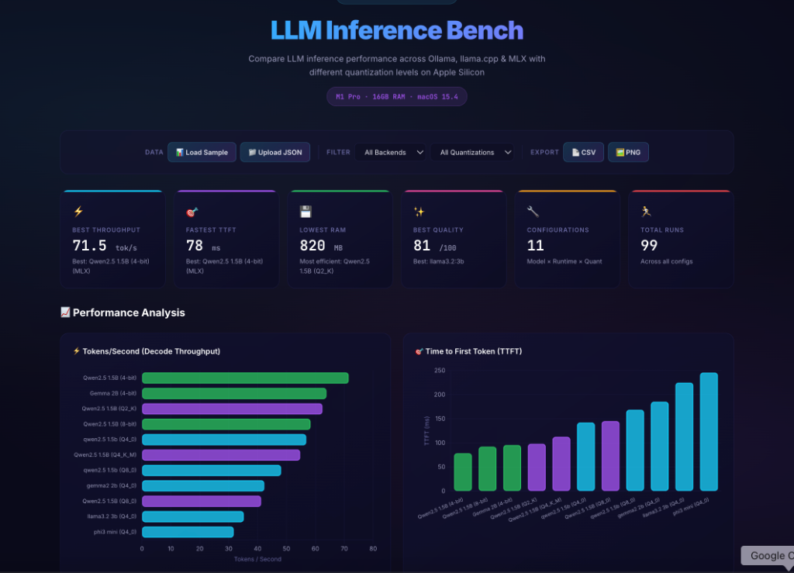
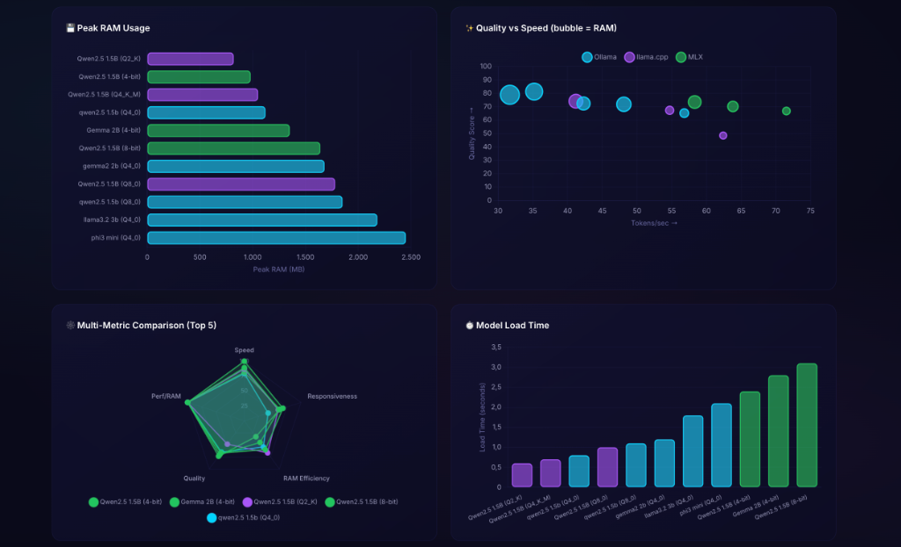
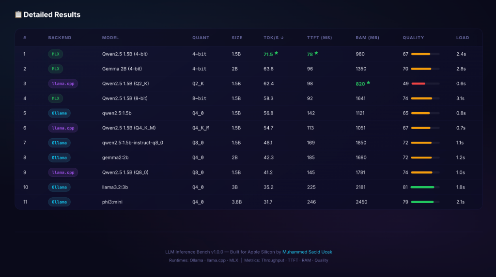

<div align="center">
  

  <br>
  <h1>⚡ LLM Inference Bench — Apple Silicon</h1>
  <p>Apple Silicon Mac'lerde aynı modeli farklı runtime'larda ve quantization seviyelerinde karşılaştıran benchmark suite</p>

  <p>
    
    
    
    
  </p>
</div>

---

## Neden Bu Projeyi Yaptım?

Apple Silicon'da yerel LLM çalıştırma seçenekleri artıyor — Ollama, llama.cpp, MLX. Ama "hangisi daha hızlı?", "quantization düşürdüğümde Türkçe kalitesi ne kadar bozuluyor?", "RAM ne kadar şişiyor?" gibi sorulara net cevap veren bir araç bulamadım.

Reddit thread'lerine güvenmek yerine kendim ölçmeye karar verdim. Bu proje o ölçümün sonucu: **aynı Türkçe prompt'ları, aynı modelin farklı versiyonlarında, 3 farklı runtime'da koşturup sonuçları karşılaştıran sistematik bir benchmark.**

---

## Ne Ölçüyor?

| Metrik | Açıklama |
|--------|----------|
| **Tokens/sec** | Decode throughput — modelin saniyede kaç token ürettiği |
| **TTFT** | Time to First Token — kullanıcının ilk cevabı ne zaman gördüğü |
| **Peak RAM** | İnference sırasında en yüksek bellek tüketimi |
| **Quality Score** | 6 boyutlu Türkçe kalite değerlendirmesi (0-100) |
| **Load Time** | Modelin belleğe yüklenme süresi |

---

## Dashboard

Sonuçlar sadece terminalde kalmıyor — glassmorphism tasarımlı interaktif bir dashboard'da görselleştiriliyor.

<div align="center">
  
  <p><i>RAM kullanımı, Quality vs Speed scatter plot, radar karşılaştırma, model yükleme süreleri</i></p>
</div>

<div align="center">
  
  <p><i>Sortable sonuç tablosu — backend, quant, tok/s, TTFT, RAM, kalite hepsi tek yerde</i></p>
</div>

---

## Mimari

```
CLI (run_benchmark.py)
    │
    ▼
Orchestrator (runner.py)
    │
    ├── Backend Layer          ── Ollama (REST API)
    │                          ── llama.cpp (Metal GPU)
    │                          ── MLX (Apple Native)
    │
    ├── Telemetry Layer        ── MemoryTracker (async thread)
    │                          ── Apple Silicon metrics
    │
    └── Evaluation Layer       ── Rule-based (6 boyut)
                               ── LLM-as-a-Judge (opsiyonel)
```

**Önemli tasarım kararları:**

- Her runtime bir `InferenceBackend` abstract class'ından türer — yeni bir runtime eklemek için ana kodu değiştirmeme gerek yok
- RAM ölçümü arka planda ayrı bir thread'de saniyede 10 kez yapılıyor (`psutil` ile RSS sampling)
- İlk ölçümden önce warmup çalıştırılıyor ki cold-start süresi gerçek inference hızını bozmasın

---

## Kalite Ölçümü

Hız önemli ama çıktı kalitesi düşükse bir anlamı yok. İki katmanlı bir değerlendirme sistemi kurdum:

**Kural Tabanlı (6 boyut):** API gerektirmez, deterministik, hızlı
- Uzunluk, anahtar kelime eşleşmesi, cümle tutarlılığı, Türkçe karakter yoğunluğu, kelime çeşitliliği, n-gram tekrar tespiti

**LLM-as-a-Judge (opsiyonel):** Semantik anlam değerlendirmesi
- Ollama üzerinden küçük bir model hakemlik yapıyor
- Halüsinasyon tespiti, olgusal doğruluk gibi regex'in yakalayamadığı şeyleri ölçüyor

> Kural tabanlı sistem "klorofil" kelimesi geçtiği için puan verir — cümle "klorofil ile fotosentez yapılmaz" dese bile. Bu bilinen bir sınırlama ve LLM-as-a-Judge tam da bunu çözmek için eklendi.

---

## Quick Start

```bash
git clone https://github.com/saciducak/LLM-Inference-Bench-Mac.git
cd LLM-Inference-Bench-Mac

pip install -r requirements.txt

# Runtimes (hangisini kullanıyorsan)
pip install mlx-lm
CMAKE_ARGS="-DGGML_METAL=on" pip install llama-cpp-python
```

```bash
# Hızlı test
python run_benchmark.py --quick --runtime ollama

# Tam benchmark
python run_benchmark.py --full

# Dashboard
python run_benchmark.py --dashboard
```

---

## Test & CI

59 test, `pytest` ile:

```bash
python -m pytest tests/ -v
```

```
tests/test_quality.py    — 22 test (kalite ölçüm fonksiyonları)
tests/test_backends.py   — 24 test (mock-based backend testleri)
tests/test_runner.py     — 13 test (aggregation, istatistik)
```

GitHub Actions ile her push'ta macOS üzerinde otomatik çalışıyor (Python 3.10, 3.11, 3.12).

---

## Geliştirme Sürecinde Öğrendiklerim

1. **UMA gerçekten fark yaratıyor.** MLX ile TTFT'ler Ollama'nın yarısına düştü çünkü CPU↔GPU arası veri kopyalama yok.
2. **Q2_K kullanılabilir değil.** RAM çok tasarruflu ama Türkçe cümle yapısı ciddi bozuluyor. Sweet spot: 4-bit (MLX) veya Q4_K_M (llama.cpp).
3. **Kalite ölçmek, hız ölçmekten çok daha zor.** Regex tabanlı başladım, n-gram repetition ekledim, sonunda LLM hakem modülünü yazmak zorunda kaldım.
4. **Warmup olmadan benchmark çöp.** İlk prompt her zaman yavaş çünkü model daha RAM'e yükleniyor. Bunu ayıklamazsanız tüm veriler yanıltıcı olur.

---

## Tech Stack

| Katman | Teknoloji |
|--------|-----------|
| Inference | `mlx-lm`, `llama-cpp-python`, Ollama REST API |
| Bellek izleme | `psutil` + `threading` (async RSS sampling) |
| Donanım tespiti | `sysctl`, `system_profiler` (GPU cores, Neural Engine, bandwidth) |
| Kalite ölçümü | Kural tabanlı 6-boyut + LLM-as-a-Judge |
| Dashboard | Vanilla JS, Chart.js, CSS3 (glassmorphism) |
| CLI | `argparse` + `rich` (renkli tablolar, progress bar) |
| Test | `pytest` (59 test), GitHub Actions CI |
| Logging | `logging` modülü (konsol + dosya) |

---

## Proje Yapısı

```
├── bench/
│   ├── backends/          # Ollama, llama.cpp, MLX backend'leri
│   ├── apple_metrics.py   # Apple Silicon donanım detayları
│   ├── config.py          # Model ve benchmark konfigürasyonu
│   ├── logger.py          # Dual-handler logging
│   ├── metrics.py         # MemoryTracker + SystemInfo
│   ├── prompts.py         # Türkçe prompt kütüphanesi (5 kategori, 9 prompt)
│   ├── quality.py         # 6-boyutlu kalite değerlendirici
│   ├── quality_judge.py   # LLM-as-a-Judge modülü
│   └── runner.py          # Benchmark orkestratörü
├── dashboard/             # Glassmorphism UI (HTML/CSS/JS)
├── tests/                 # 59 pytest testi
├── results/               # Benchmark sonuçları (JSON)
├── run_benchmark.py       # CLI entry point
└── PROJECT_DEEP_DIVE.md   # Detaylı mimari doküman
```

---

## Roadmap

- [ ] Energy profiling — `powermetrics` ile Watt/1000 token ölçümü
- [ ] Concurrency test — `asyncio` ile eşzamanlı yük testi
- [ ] Needle-in-a-Haystack — uzun context KV Cache degradasyon testi
- [ ] Cross-device comparison — farklı Mac'lerden sonuç karşılaştırma

---

*Detaylı mimari doküman için → [PROJECT_DEEP_DIVE.md](PROJECT_DEEP_DIVE.md)*
