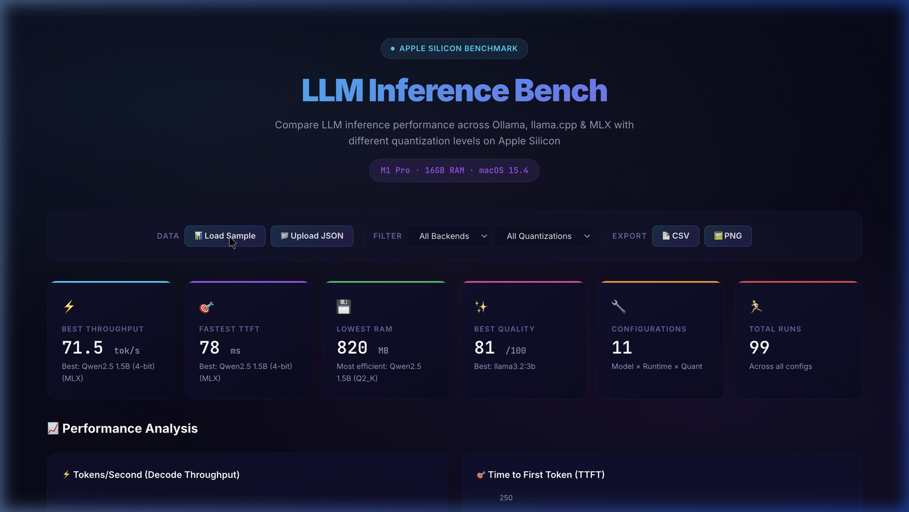
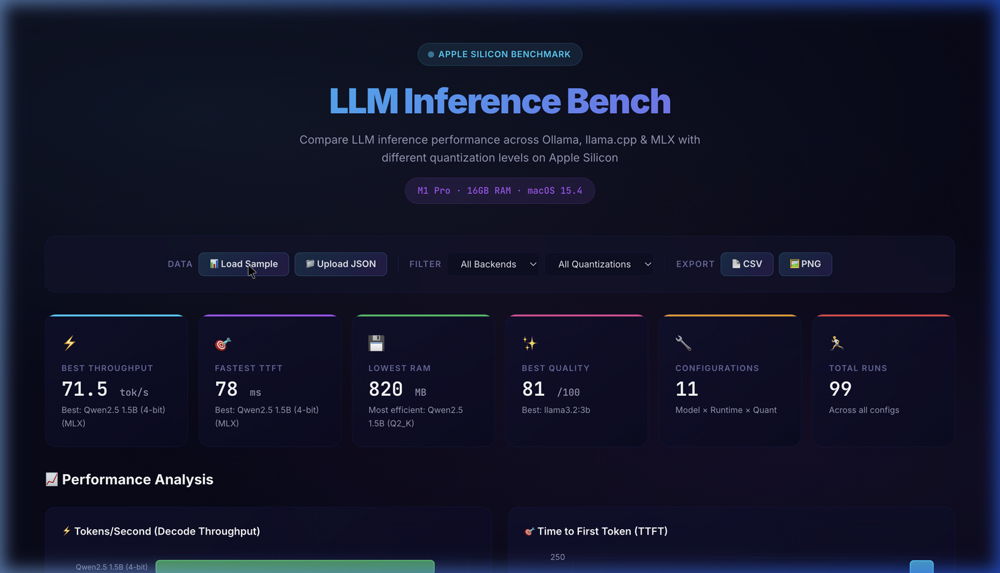
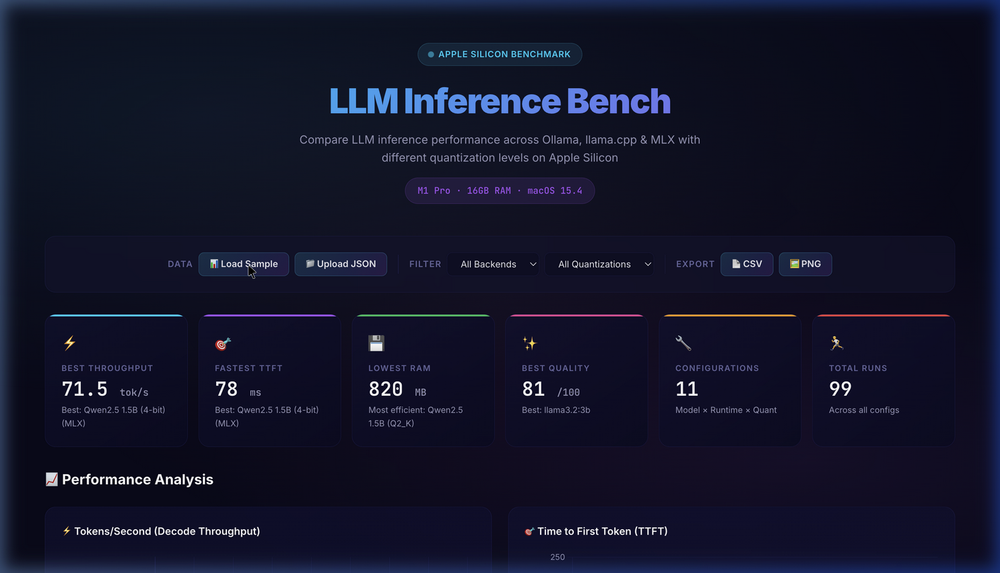

<div align="center">
  

  <br>
  <h1>⚡ LLM Inference Bench — Apple Silicon</h1>
  <p><b>Empirical Analysis of LLM Runtimes, Quantization, and Unified Memory Exploitation on Apple Silicon</b></p>

  <p>
    <a href="https://github.com/saciducak/LLM-Inference-Bench-Mac/issues"></a>
    
    
    <a href="LICENSE"></a>
  </p>
</div>

---

## 🚀 Executive Summary

**LLM-Inference-Bench-Mac** is a specialized, production-grade benchmarking suite designed to measure the true empirical performance of Local LLMs on Apple's ARM-based M-series architecture. 

Rather than relying on theoretical FLOPS, this suite executes robust evaluations across **Ollama (REST API)**, **llama.cpp (GGUF bindings)**, and **MLX (Native Apple Silicon)**. It quantifies the tradeoffs between various quantization techniques (e.g., MLX 4-bit vs. GGUF Q4_K_M vs. Q8_0) across core dimensions: **Latency (TTFT), Throughput (Tok/s), Memory Efficiency (Peak RAM), and Generation Quality**.

This tool is built for AI Engineers and researchers who need concrete, data-driven answers to: *"Which runtime and quantization strategy yields the optimal Pareto frontier of speed and quality for a given model on my specific Mac?"*

---

## 🧠 Engineering Rigor & Methodology

Benchmarking LLMs is notoriously prone to variance. This suite enforces strict engineering rigor:

* **Cold vs. Warm Starts:** Supports explicit warmup iterations to separate model I/O load times from pure inference throughput.
* **Deterministic Sampling:** Enforces strict temperature and token limits across all backends to ensure apples-to-apples comparisons.
* **Process-Level Telemetry:** Utilizes asynchronous background threads polling `psutil` to capture accurate Peak RSS (Resident Set Size) memory footprints during the exact inference window.
* **Semantic Quality Scoring:** Speed is irrelevant if the model outputs garbage. The suite includes a deterministic, 5-dimensional NLP evaluator specifically tuned for **Turkish language generation** (evaluating Length, Keyword Recall, Coherence, Turkish Character Density, and Lexical Relevance).

---

## 📊 Interactive Analytics Dashboard

The suite ships with a premium, glassmorphism-styled local web dashboard. It parses the benchmark JSON outputs and renders multi-dimensional visual analytics.

<div align="center">
  
  <p><i>Real-time visualization of Throughput, TTFT, and Peak RAM across runtimes.</i></p>
</div>

### Dashboard Features:
1. **Decode Throughput Bar Charts:** Direct comparison of Tokens/Second.
2. **Quality vs. Speed Scatter Plot:** Bubble chart (bubble size = RAM footprint) to instantly identify Pareto-optimal configurations.
3. **Radar Charts:** Multi-metric overlay mapping Speed, Responsiveness (TTFT), RAM Efficiency, and Quality on a normalized 0-100 scale.
4. **Sortable Data Grid:** Deep dive into raw metrics with integrated quality score sparklines.

<div align="center">
  
</div>

---

## 🏗️ Architecture & Backends

The engine is built around an abstract `InferenceBackend` interface, allowing seamless integration of new runtimes. Current support includes:

| Runtime Engine | Binding Strategy | Optimal Use Case | Supported Quantization |
| :--- | :--- | :--- | :--- |
| **MLX (`mlx-lm`)** | Native Apple Metal API | **Maximum Throughput** & Research | 4-bit, 8-bit |
| **llama.cpp** | `llama-cpp-python` (Metal Offload) | **Granular Control** & Portability | GGUF (Q2_K, Q4_K_M, Q8_0, FP16) |
| **Ollama** | REST API Streaming | **Developer Ergonomics** & Deployment | Q4_0, Q8_0 (Ollama Registry) |

### Why Apple Silicon Matters
Unlike discrete CUDA GPUs connected via PCIe (which suffer from VRAM transfer bottlenecks), Apple Silicon utilizes **Unified Memory Architecture (UMA)**. This benchmark empirically demonstrates how tools like `mlx` achieve zero-copy memory access, drastically reducing Time-To-First-Token (TTFT) compared to traditional localized serving.

---

## ⚡ Quick Start

### 1. Prerequisites
Ensure you are on an Apple Silicon Mac (M1/M2/M3/M4).
```bash
# Clone the repository
git clone https://github.com/saciducak/LLM-Inference-Bench-Mac.git
cd LLM-Inference-Bench-Mac

# Install core dependencies
pip install -r requirements.txt
```

*(Optional but recommended)* Install your target backends:
```bash
# For MLX support
pip install mlx-lm

# For llama.cpp support (Ensure Xcode Command Line Tools are installed)
CMAKE_ARGS="-DGGML_METAL=on" pip install llama-cpp-python
```

### 2. Verify Environment
Run the setup check to ensure the architecture is recognized and backends are correctly bound:
```bash
python setup_check.py
```

### 3. Execute Benchmarks
```bash
# Fast sanity check (1 prompt, 1 iteration)
python run_benchmark.py --quick --runtime ollama

# Standard evaluation matrix (~10 minutes)
python run_benchmark.py

# Full comprehensive stress test (~30 minutes)
python run_benchmark.py --full
```

### 4. Launch Analytics
Fire up the local HTTP server to interact with the generated `.json` metrics:
```bash
python run_benchmark.py --dashboard
```

---

## 👤 Author & Contributions

Built with an engineering focus on deterministic optimization by **[Muhammed Sacid Ucak](https://github.com/saciducak)**. 

If you are an AI Engineer optimizing local edge deployments or a researcher exploring quantization degradation boundaries, PRs and architectural discussions are highly welcomed.

<br>

---
<div align="center">
  <i>"Optimization without empirical measurement is just guessing."</i>
</div>
